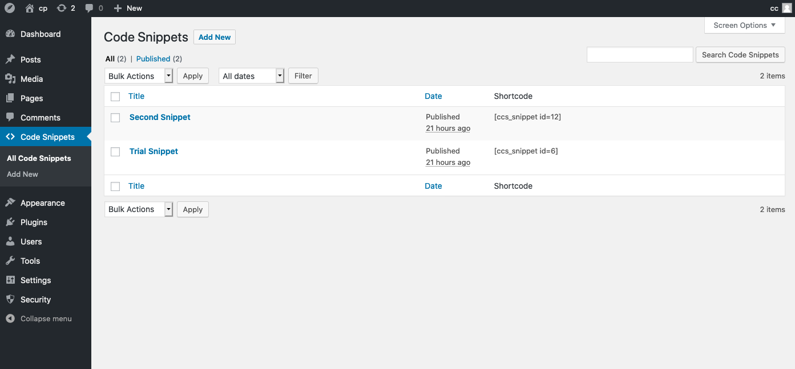
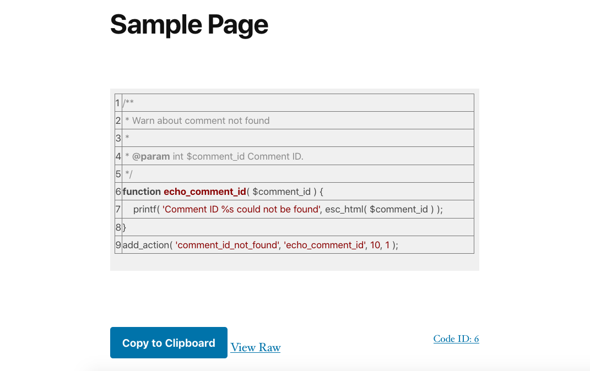

# Classic Code Snippets.

This is a **[ClassicPress Research](https://www.classicpress.net/)** built plugin to find an alternative to using gist for displaying code snippets on a ClassicPress site page or post.

## Credits.
Classic Code Snippets is a fork of SC Display Code (sc-display-code) originally developed by Alan and Jack Coggins at Simply Computing (https://simplycomputing.com.au).

## How it works.
The plugin uses highlight.js to provide syntax highlighting.

Code snippets are saved or edited in the custom post type `ccs_snippet`. The plugin uses a shortcode like [ccs_snippet id=19] to display the code snippet on a page or post.

## How to use.
- Download the plugin zip
- Install and activate the plugin via plugins admin.
- Add a code snippet via the Code Snippet post type.
- 

- Paste your code generated code snippet to a post/page.

- Add the snippet with the post id of the snippet e.g. `[ccs_snippet id="19"]` in any post or page.

- You can also view the code snippet as a raw text.

